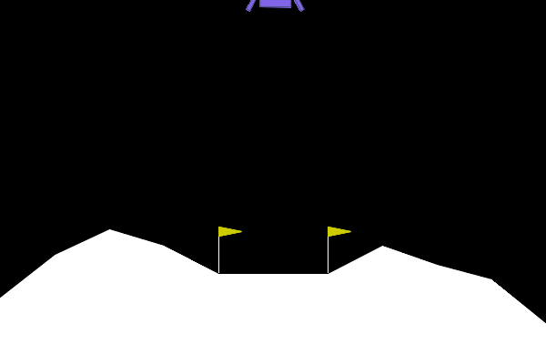

# DQN Agent for LunarLander-v2 using PyTorch




This project implements a Deep Q-Network (DQN) agent to solve the `LunarLander-v3` environment from the [Gymnasium](https://gymnasium.farama.org/) library. The agent is built using PyTorch.

## Overview

The Deep Q-Network (DQN) algorithm learns optimal policies in reinforcement learning environments by approximating the optimal action-value function, Q*(s,a). This project applies DQN to the classic LunarLander control problem, where the agent must learn to safely land a lunar module.

## Features

* **Deep Q-Network (DQN):** A neural network built with PyTorch (`QNetwork` class) approximates the Q-values.
* **Experience Replay:** Stores experiences (state, action, reward, next_state, done) in a replay buffer (`deque`) to break correlations and improve learning stability.
* **Epsilon-Greedy Exploration:** Balances exploration of new actions with exploitation of known good actions. Epsilon (exploration rate) decays over training.
* **Periodic Evaluation:** The agent's performance is evaluated periodically on a set number of episodes without exploration to gauge learning progress.
* **Early Stopping:** Training automatically stops if the agent achieves the `TARGET_SCORE_AVG` during periodic evaluations.
* **Model Persistence:** Trained model weights can be saved to (`.pth` file) and loaded for continued training or evaluation.
* **Progress Visualization:** Training progress (scores per episode, evaluation scores) is plotted using Matplotlib and saved as an image.
* **Results Logging:** Detailed training statistics are logged to a CSV file using Pandas.
* **Configurable Hyperparameters:** Key parameters (network architecture, learning rate, batch size, etc.) are defined in the `exp_spec` dictionary and constants at the top of the script.

## Requirements

* Python 3.8+
* PyTorch
* Gymnasium (with Box2D)
* NumPy
* Pandas
* Matplotlib

You can install the necessary packages using the provided `requirements.txt`:
```shell
pip install -r requirements.txt
